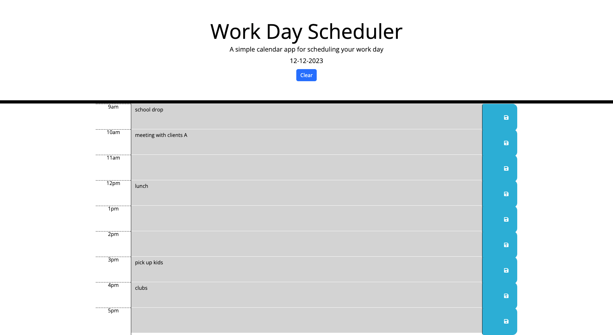

# MJ-planner-app

## Description

In this project, I made the day planner using javascript and jquery. 
When it is current time,
it will show in pink color. When it is past time, it will show in grey color.
In future time, it will show in green color.
The day plan will be saved to the local storage, and when you click the clear button, it will be deleted.

[Click here to the Webpage](https://salala1005.github.io/MJ-planner-app/)

[Click here to the Github page](https://github.com/Salala1005/MJ-planner-app)